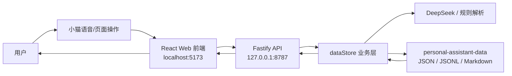
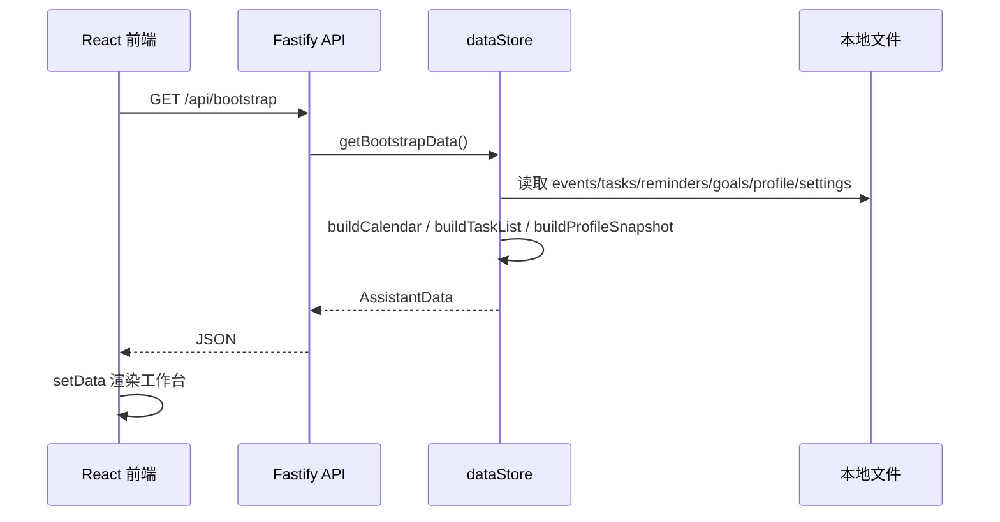
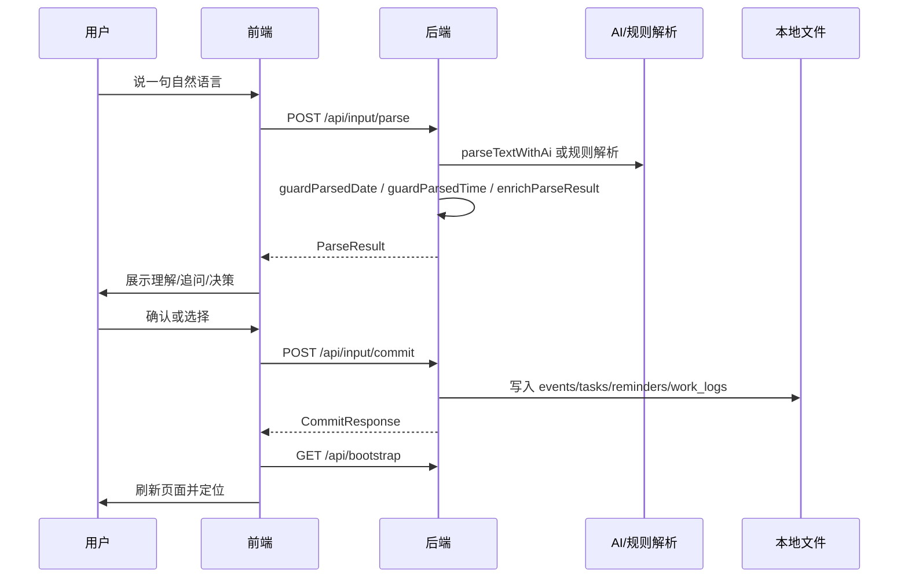

# YayaMind SDD｜开发设计与实现流程

## 1. 文档目的

本文是面向面试讲解的 SDD 整合版。它不替代 `docs/sdd/` 下已有模块文档，而是把当前项目的技术方案、模块拆解、开发流程和数据流串成一条可讲述的线。

已有详细模块文档：

- `docs/sdd/00-product-scope.md`
- `docs/sdd/01-data-schema.md`
- `docs/sdd/02-input-parser.md`
- `docs/sdd/03-page-state.md`
- `docs/sdd/04-calendar-view.md`
- `docs/sdd/05-today-panel.md`
- `docs/sdd/06-conflict-reschedule.md`
- `docs/sdd/07-cat-widget.md`
- `docs/sdd/08-reminders.md`
- `docs/sdd/09-ai-strategy.md`
- `docs/sdd/10-tech-stack.md`
- `docs/sdd/12-local-api-contract.md`
- `docs/sdd/14-16 V1.1 迭代文档`

## 2. 技术栈

### 前端

- React 19；
- TypeScript；
- Vite；
- 单页应用结构；
- 核心文件：`src/App.tsx`；
- 样式文件：`src/styles.css`；
- 资源文件：`src/assets/ragdoll-avatar.png`。

### 后端

- Node.js；
- Fastify；
- TypeScript；
- tsx 运行开发服务；
- 核心入口：`server/index.ts`；
- 数据与业务逻辑：`server/dataStore.ts`；
- AI 接入：`server/aiAdapter.ts`；
- 类型定义：`server/types.ts`。

### 数据层

本地文件存储，目录为 `personal-assistant-data/`：

- `events.jsonl`：日程和时间块；
- `tasks.jsonl`：任务、截止任务、项目待办；
- `todo_projects.json`：项目分类；
- `work_logs.jsonl`：执行记录；
- `reminders.jsonl`：提醒；
- `goals.json`：阶段目标；
- `profiles.json`：个人画像；
- `settings.json`：本地配置；
- `summaries/`：每日/每周 Markdown 总结。

### AI 能力

- 有 `DEEPSEEK_API_KEY` 时使用 DeepSeek；
- 没有 key 或调用失败时回退本地规则；
- AI 主要负责自然语言解析、意图分类、转写纠错；
- 关键写入仍由后端规则守卫。

## 3. 运行架构

Vite 配置中 `/api` 被代理到 `http://localhost:8787`。因此前端代码可以直接调用 `/api/bootstrap`、`/api/input/parse` 等接口，开发时不会遇到跨域问题。

## 4. 模块拆解

### 4.1 Web 工作台模块

职责：

- 展示一周日程；
- 展示项目待办；
- 展示目标、画像、总结；
- 控制右侧详情；
- 管理小猫浮窗。

核心状态：

- `data`：后端返回的完整初始化数据；
- `viewMode`：当前页面，一周、待办、目标、画像、总结；
- `selectedDate`：右侧详情选中的日期；
- `parsePreview`：输入理解预览；
- `pendingClarification`：等待补充的问题；
- `pendingDecision`：冲突/重复等决策；
- `pendingPostCommit`：写入后的确认/修改/取消；
- `dragPreview`：日程拖拽中的实时预览；
- `todoProjectPage`：项目待办核心页或其他项目页。

### 4.2 本地 API 模块

`server/index.ts` 暴露以下主要接口：

- `GET /api/bootstrap`：前端初始化；
- `GET /api/calendar`：日历数据；
- `GET /api/today`：今日面板；
- `POST /api/input/parse`：只解析，不写入；
- `POST /api/input/commit`：解析并写入；
- `PATCH /api/events/:id`：更新日程；
- `DELETE /api/events/:id`：软删除日程；
- `POST /api/tasks`：手动创建待办；
- `PATCH /api/tasks/:id`：更新待办；
- `DELETE /api/tasks/:id`：软删除待办；
- `POST /api/todo-projects`：创建项目分类；
- `PATCH /api/todo-projects/:id`：更新项目分类；
- `DELETE /api/todo-projects/:id`：删除项目分类；
- `POST /api/summaries/generate`：生成 Markdown 总结；
- `GET /api/ai/status`：查看 AI 配置状态。

### 4.3 数据存储模块

`server/dataStore.ts` 是后端核心。

职责：

- 确保本地数据文件存在；
- 读取 JSON/JSONL；
- 写入 JSON/JSONL；
- 构造 `bootstrap` 数据；
- 解析自然语言；
- 写入日程、待办、提醒、执行记录；
- 处理冲突、重复、过载；
- 生成总结和个人画像。

关键函数：

- `getBootstrapData()`：聚合前端所需数据；
- `parseAndEnrichTextInput()`：解析和增强输入；
- `commitTextInput()`：提交输入并写入；
- `buildCalendar()`：构造一周日程；
- `buildTaskList()`：构造项目待办列表；
- `inferTimeInfo()`：提取时间；
- `inferTodoProjectTitle()`：推断待办项目；
- `checkConflicts()`：检查日程冲突。

### 4.4 AI adapter 模块

`server/aiAdapter.ts` 负责与外部模型交互。

设计原则：

- AI 是增强，不是唯一依赖；
- 规则优先处理高确定性场景；
- AI 返回结果必须经过后端 guard；
- 不把密钥返回到前端；
- 解析失败时回退规则结果。

典型用途：

- 纠正“项目代办”到“项目待办”；
- 识别新增、修改、补充等意图；
- 提取标题、时间、准备事项；
- 在复杂中文口语输入中补强规则解析。

### 4.5 一周日程模块

职责：

- 将 `events` 按日期分组；
- 渲染 7 列；
- 根据开始/结束时间计算 `top` 和 `height`；
- 支持拖动移动和拉伸时间块；
- 支持冲突并列展示；
- 支持未来安排视图。

当前交互：

- 时间轴 7:00-24:00；
- 半小时一格；
- 拖动按半小时吸附；
- 右侧展示完整详情。

### 4.6 项目待办模块

职责：

- 展示工作、学校、生活三列；
- 其他项目进入分页；
- 支持新增、编辑、完成、删除；
- 支持拖到月历设置 deadline；
- 日期 tag 通过色阶表达紧急程度。

数据结构：

- 项目存入 `todo_projects.json`；
- 待办存入 `tasks.jsonl`；
- `TaskRecord.projectId` 关联项目。

### 4.7 小猫输入模块

职责：

- 作为主要输入入口；
- 承载语音状态；
- 展示理解预览、追问、冲突决策；
- 写入后提供确认/修改/取消。

关键逻辑：

- 浏览器语音识别产生 transcript；
- 前端调用 `/api/input/parse`；
- 展示解析结果或追问；
- 用户确认后调用 `/api/input/commit`；
- 写入成功后刷新 `/api/bootstrap`。

## 5. 核心数据流

### 5.1 初始化数据流

### 5.2 自然语言写入数据流

### 5.3 项目待办 deadline 数据流

## 6. 关键设计决策

### 本地优先

理由：

- 作品集阶段不需要账号体系；
- 避免云同步和隐私成本；
- 方便用户检查真实数据；
- 便于后续迁移到 Obsidian 或桌面应用。

### Web MVP 先行

理由：

- 能快速验证 UI 和交互；
- 前后端开发成本低；
- 可以模拟桌面助手工作台；
- 后续迁移桌面壳时保留核心逻辑。

### AI + 规则混合

理由：

- 纯 AI 不稳定，容易误写字段；
- 纯规则难处理口语输入；
- 混合方案更符合真实产品的成本和可靠性要求。

### 小猫作为主入口

理由：

- 降低记录任务时的心理负担；
- 让 AI 能力具象化；
- 形成产品记忆点；
- 面试展示时更容易讲清差异化。

## 7. 开发流程回顾

### 阶段 1：产品发现

- 明确不是普通日历或 TODO；
- 确认核心体验是个人执行助手；
- 收敛到 Web MVP；
- 建立小猫浮窗和一周工作台方向。

### 阶段 2：MVP 实现

- 搭建 React/Vite 前端；
- 搭建 Fastify 后端；
- 设计本地数据文件；
- 实现初始化数据和基础写入；
- 完成一周日程和右侧详情。

### 阶段 3：V1.1 打磨

- 加强语音输入；
- 增加确认/修改/取消；
- 改进项目待办；
- 优化日程拖拽；
- 增强 AI 纠错；
- 调整视觉风格和信息密度。

### 阶段 4：作品集收尾

- 补充 PRD、SDD、竞品分析；
- 补充项目详情和面试 Q&A；
- 形成可复述、可展示的面试材料。

## 8. 风险与处理

### 语音识别误差

处理：

- 前端显示修正后的转写；
- 后端增加常见错词纠正；
- 写入前可确认；
- 写入后可修改。

### AI 误判字段

处理：

- 后端 guard；
- 待办备注不接受日程地点类误判；
- 明确时间优先用本地规则覆盖 AI；
- 低置信度进入追问。

### 数据污染

处理：

- 软删除代替硬删除；
- 本地文件可检查；
- 测试数据用后删除；
- 数据目录默认不进入版本管理。

### 页面信息密度

处理：

- 中间周视图只显示短标题；
- 具体内容放右侧详情；
- 项目待办按三列分组；
- 时间轴压缩到半小时粒度。

## 9. 验收标准

- `npm run build` 通过；
- 前端 `5173` 可访问；
- 后端 `8787/api/bootstrap` 返回 200；
- 新增日程能写入 `events.jsonl`；
- 新增待办能写入 `tasks.jsonl`；
- 项目待办能按工作/学校/生活分列；
- 小猫输入能完成解析、确认、提交；
- 总结能写入 Markdown；
- README 能引导读者找到面试文档。

