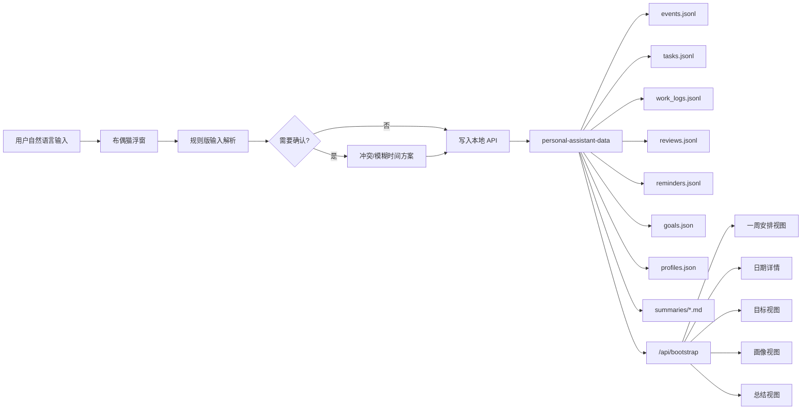

# YayaMind 架构说明

## 产品定位

YayaMind 是一个本地优先的个人助手 Web MVP，用网页模拟未来桌面助手的工作台形态。核心不是单纯记录 TODO，而是把日程、任务、提醒、真实执行、冲突确认、复盘总结和个人画像放在同一套本地数据闭环里。

## 架构图

## 模块职责

- 前端 `src/App.tsx`：工作台状态、视图切换、自然语言输入、冲突方案提交、提醒处理、目标/画像/总结入口。
- 样式 `src/styles.css`：深色工作台、一周日历、右侧日期详情、可拖动布偶猫浮窗。
- 后端 `server/index.ts`：本地 API 路由，包括 bootstrap、输入解析/提交、提醒、目标、画像和总结生成。
- 数据层 `server/dataStore.ts`：JSON/JSONL 文件初始化、读写、冲突检测、日历构建、目标和总结数据处理。
- 类型 `server/types.ts`：日程、任务、提醒、目标、画像等本地数据结构。

## MVP 边界

当前版本使用规则解析和本地文件，不接入真实 AI 模型、不常驻系统托盘、不访问真实桌面屏幕。这样做的好处是先验证核心体验：用户能不能用自然语言把安排写进去，系统能不能在冲突和执行记录上给出可理解的反馈。
