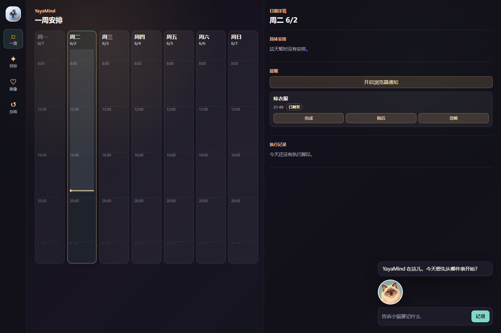

# YayaMind 作品集材料

这个目录用于对外展示 YayaMind Web MVP 的产品思路、技术实现和演示方式。

## 文件索引

- [ARCHITECTURE.md](ARCHITECTURE.md)：架构说明和 Mermaid 架构图。
- [FEATURES.md](FEATURES.md)：已实现功能和数据闭环说明。
- [DEMO_GUIDE.md](DEMO_GUIDE.md)：推荐演示顺序和讲解重点。
- [DEMO_DATA.md](DEMO_DATA.md)：可用于演示的输入样例。
- [screenshots/yayamind-workbench.png](screenshots/yayamind-workbench.png)：当前 MVP 工作台截图。
- [../interview/README.md](../interview/README.md)：面向 AI 产品经理面试的 PRD、SDD、竞品分析、项目详情和 Q&A。

## 当前截图

